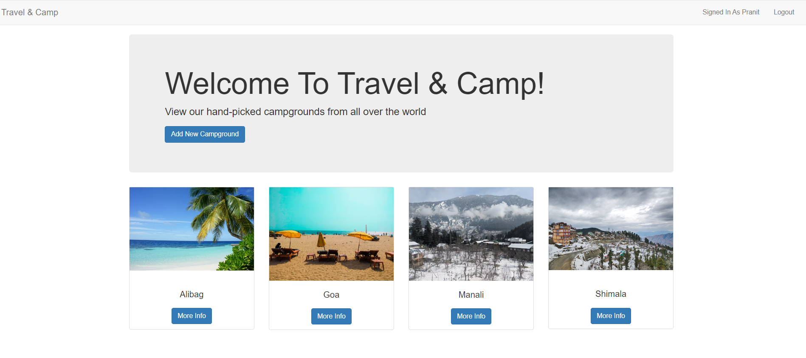
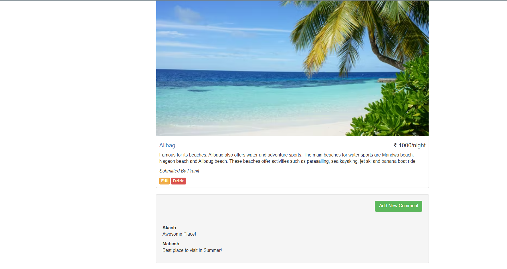

# Travel & Camp
Travel & Camp is a website where users can create and review campgrounds. In order to review or create a campground, you must have an account.

This project was created using Node.js, Express, MongoDB, and Bootstrap.

## Features :
  - Users can create, edit, and remove campgrounds.
  - Users can review campgrounds once, and edit or remove their review.
  - User profiles include more information on the user (full name), their campgrounds.

